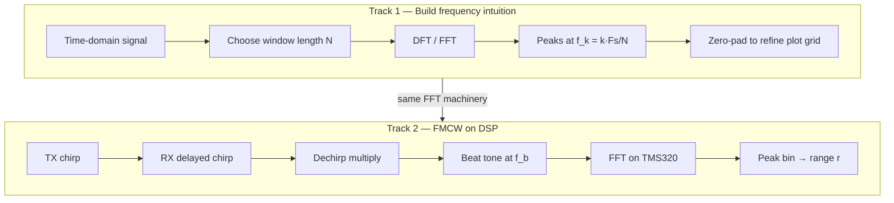

# Frequency‑Domain Sensing — DFT Exploration & FMCW Radar FFT on TI TMS320

Every sensor reading is really a signal changing over time. The **Fourier transform** answers a simple question — *what frequencies are inside this signal?* — and that answer is how radars figure out **how far away** something is. This repo walks that idea in two steps: first in MATLAB (build intuition for DFT bins, resolution, and zero‑padding), then on a **TI DSP board** where an FFT turns a dechirped FMCW radar echo into a **range peak**.

> This is a **DSP + radar fundamentals** project, not a plug‑and‑play demo. You will see complex exponentials, chirp de‑ramping, fixed‑point‑adjacent C on a C6713, and the gap between a textbook FFT and a vendor‑optimized kernel.

<p align="center">
  
  <br/>
  <sub>Fig 1 — FMCW transmit vs. delayed echo. After dechirp, delay becomes a beat tone the FFT can locate.</sub>
</p>

## At a glance

| | |
|---|---|
| **Core idea** | Move from **time** to **frequency** to extract structure — first on audio‑like signals, then on radar beat tones. |
| **Track 1 — DFT lab** | Vowel synthesis, window length vs. resolution, zero‑padding for a finer spectral *grid* (not new content). |
| **Track 2 — FMCW radar** | Linear chirp → echo delay → **dechirp** → dominant tone → **FFT peak** → **range**. |
| **Hardware** | **TMS320C6713 DSK** + **AIC23 codec** — FFT magnitude streamed to DAC so you can hear the spectrum. |
| **Honest scope** | Understanding and signal‑chain literacy; not a full RF front‑end or automotive radar product. |

## Skills in play

This repo touches several areas that usually show up together in radar/DSP coursework and early industry roles:

| Area | What you actually do here |
|------|---------------------------|
| **Fourier analysis** | Define the DFT, relate bin spacing $\Delta f = F_s/N$, compare window lengths and zero‑padding. |
| **Spectral leakage & resolution** | See why longer captures separate nearby tones; why zero‑padding smooths plots without creating new frequencies. |
| **FMCW ranging** | Connect chirp slope, beat frequency $f_b$, and range $r$ through dechirp math. |
| **Embedded DSP (C)** | Run FFT on precomputed dechirped data on the **C6713**; optional **MTI** path in `C_code`. |
| **Real‑time I/O** | McBSP + codec ISR streams FFT bins to audio at 8 kHz — board‑specific scaling and sign fixups. |
| **MATLAB signal design** | `experiment.m` — FIR truncation, Gibbs phenomenon, `firls()` comparison, filter–noise exercises. |
| **Performance awareness** | Compare naïve C FFT vs. TI **DSPLib** cycle counts on the same data. |

If DFT notation, complex baseband, or interrupt‑driven codecs are new, expect to read slowly — the math below is meant to reward that effort.

---

## How the two tracks connect



**Track 1** teaches what the frequency axis *means*. **Track 2** uses that machinery where the “tone” is distance encoded as $f_b$ after dechirp.

---

## Hardware setup

On‑target code in `C_code` targets the **Texas Instruments TMS320C6713 DSK** (Spectrum Digital DSK‑6713), the same family of kit used in many university radar labs.

| Component | Role |
|-----------|------|
| **C6713 CPU** | Floating‑point FFT (`FFT()` helper or `DSPF_dp_cfftr2`), Hanning window on dechirped samples, optional MTI across chirps. |
| **AIC23 audio codec** | DAC output at **8 kHz** — FFT magnitude per bin played through headphones so the range spectrum is audible. |
| **McBSP + INT11** | `c_int11()` ISR walks FFT bins each sample period; stereo 32‑bit frames via `MCBSP_write`. |
| **Precomputed chirp data** | `with_barrier/data_dechirp.h` — dechirped I/Q arrays from the lab capture pipeline (barrier scenario). |

**Runtime flow (`C_code`)**

1. `initialize()` — board PLL/EMIF, codec, McBSP, map codec XMIT to CPU interrupt 11.  
2. `single_chirp_processing()` — load one chirp’s dechirped samples, optional Hanning, run FFT.  
3. `mti_processing()` (when `USE_MTI = 1`) — three‑pulse MTI across slow‑time chirps before output.  
4. ISR — scale magnitude to 16‑bit audio (`convert_double_to_short_for_output`), account for DAC inversion on this board.

Build and flash with **Code Composer Studio** and the C6713 toolchain; `C_code` is a reference snapshot — full linker/vector support lives in the course project tree alongside `FFT_helper` and data headers.

---

## Track 1 — DFT, resolution, and zero‑padding

**DFT definition (what the FFT computes):**

$$
X[k] = \sum_{n=0}^{N-1} x[n]\,e^{-j2\pi kn/N},\qquad k=0,\dots,N-1.
$$

**Bin locations and spacing.** With sampling rate $F_s$, bin $k$ represents $f_k = k\,\dfrac{F_s}{N}$, so the spacing is

$$
\Delta f = \frac{F_s}{N}.
$$

**Why $N$ matters.** A larger $N$ gives smaller $\Delta f$, so nearby tones land in separate bins instead of blending.  
**Zero‑padding** increases $N$ by appending zeros; it *samples the same spectrum more finely* (smoother curves, clearer peaks) but does **not** add new frequency content.

### Resolution on a real signal (vowel “/A/”)

The synthesized vowel has a clear pitch period. Taking the DFT of **1 → 5 periods**, then zero‑padding to a fixed length, shows two ideas side by side:

- **Longer windows** → narrower main lobe, less leakage between nearby tones.  
- **Zero‑padding** → finer frequency *grid* for plotting, not new physics.

<p align="center">
  
  <br/>
  <sub>Fig 7 — Zero‑padded spectra for one to five natural periods. Longer records → finer resolution; zero‑padding refines the grid.</sub>
</p>

### MATLAB FIR experiment (`experiment.m`)

Separate from the radar chain, `experiment.m` walks **FIR design by truncation**: Gibbs ringing at the cutoff, linear‑phase checks, comparison with `firls()`, and filtering white noise via `conv()` vs. `filter()`. Useful groundwork if you extend the front‑end before FFT/MTI.

---

## Track 2 — FMCW radar: dechirp → FFT → range

**Dechirp (plain language).** The transmitter sends a **linear chirp** (frequency ramps up over time). The echo is a **delayed** copy. Multiply the received signal by the **conjugate** of the transmit chirp and you get a **single tone** at the **beat frequency** $f_b$. Longer delay → higher $f_b$. An FFT finds that tone’s bin; geometry turns bin index into **range**.

**Relationships used.** For bandwidth $B$ swept over $t_{\text{sweep}}$ (chirp slope $S=B/t_{\text{sweep}}$):

$$
f_b = S\,\delta t \quad\Rightarrow\quad \delta t = \frac{f_b\,t_{\text{sweep}}}{B}.
$$

Range from round‑trip delay $r = \tfrac{c\,\delta t}{2}$. With an $N_{\text{FFT}}$‑point FFT and ADC rate $F_s$, peak bin $n_{\text{peak}}$ gives

$$
r = \frac{c\,t_{\text{sweep}}}{2B}\;\frac{F_s\,n_{\text{peak}}}{N_{\text{FFT}}},
$$

where $c$ is the speed of light.

<p align="center">
  
  <br/>
  <sub>Fig 2 — Dechirped signal: dominant tone at beat frequency $f_b$.</sub>
</p>

**On the TMS320**, the vendor **DSP FFT** kernel reaches the same peak location with fewer cycles than a naïve C FFT — a concrete example of why embedded radar stacks ship optimized libraries.

<p align="center">
  
  <br/>
  <sub>Fig 8 — FFT of dechirped signal (C FFT).</sub>
</p>

<p align="center">
  
  <br/>
  <sub>Fig 9 — FFT via DSP library. Same target peak, fewer cycles.</sub>
</p>

---

## Why this works (short intuition)

- **DFT bins act like frequency measuring cups.** A longer record creates more, smaller cups (narrower $\Delta f$), so close tones separate instead of blending.  
- **Zero‑padding changes the ruler, not the song.** It interpolates the same spectrum to make peaks and sidelobes look smooth.  
- **Dechirp turns distance into a tone.** Delay $\delta t$ → beat $f_b$ → FFT peak → range $r$; an optimized FFT makes that conversion fast enough for real‑time lab work.

---

## Glossary

| Term | Meaning |
|------|---------|
| **DFT / FFT** | Discrete Fourier Transform and its fast $O(N\log N)$ algorithm. |
| **Zero‑padding** | Append zeros to increase $N$ so the plotted spectrum is sampled more finely. |
| **Window length** | Number of original samples used; longer windows improve true resolution and reduce leakage. |
| **FMCW** | Frequency‑modulated continuous‑wave radar; range maps to dechirped tone frequency. |
| **Dechirp** | Multiply RX by conjugate of TX chirp to collapse delay into a sinusoid. |
| **Beat frequency $f_b$** | Tone frequency after dechirp; proportional to target delay. |
| **$n_{\text{peak}}$** | FFT bin index of the detected peak. |
| **MTI** | Moving Target Indicator — slow‑time filtering across chirps (optional in `C_code`). |

---

## Repository layout

```
F-Domain-Sensing/
├─ README.md
├─ experiment.m          # FIR truncation, Gibbs, firls comparison, noise filtering
├─ C_code                # C6713 DSK: dechirp FFT + optional MTI + AIC23 playback
└─ LICENSE
```

Figures and derivations live in this README; DSP data headers and CCS project files come from the associated radar lab toolchain.

---

## License

MIT — see `LICENSE`.
